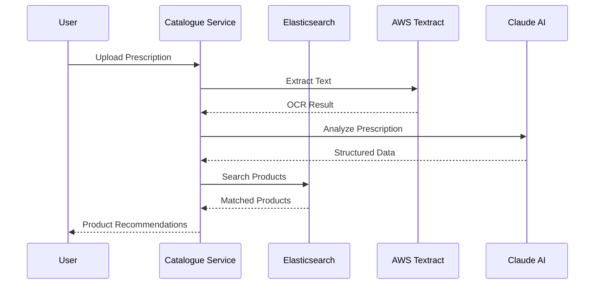
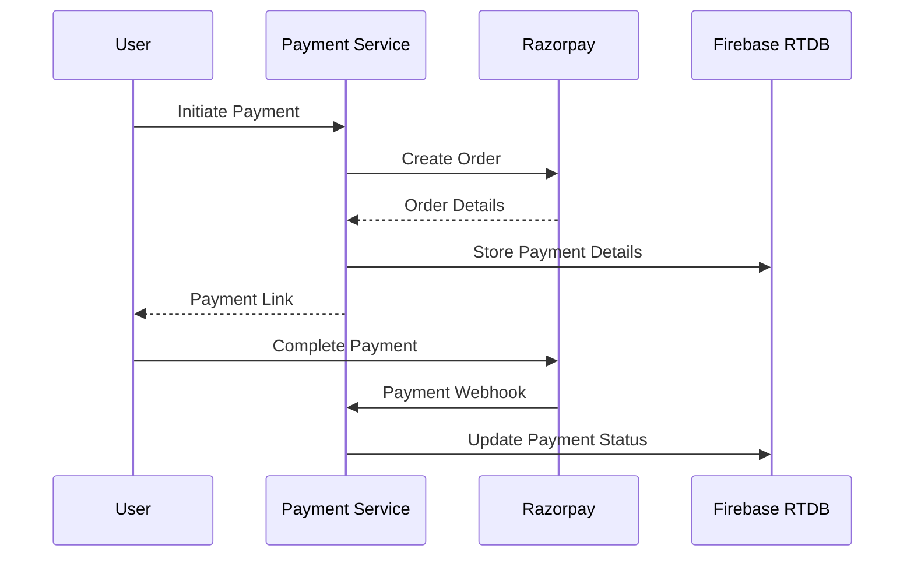
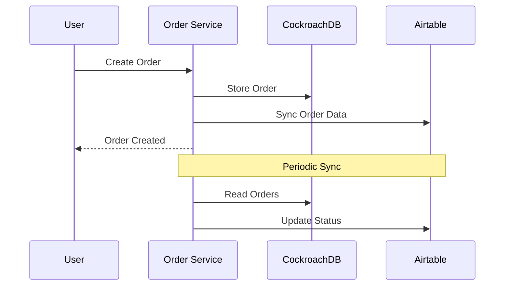
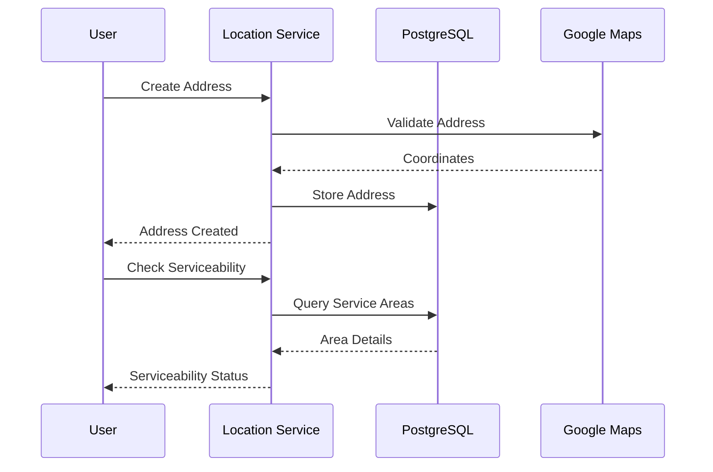
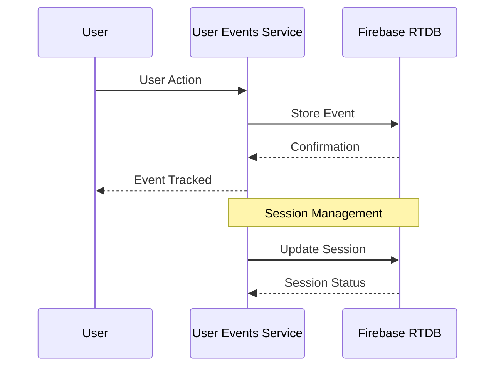
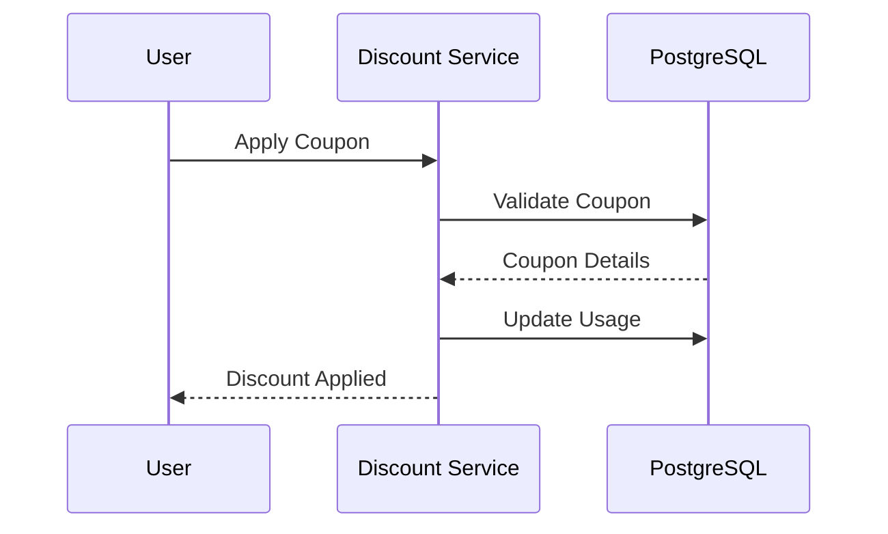
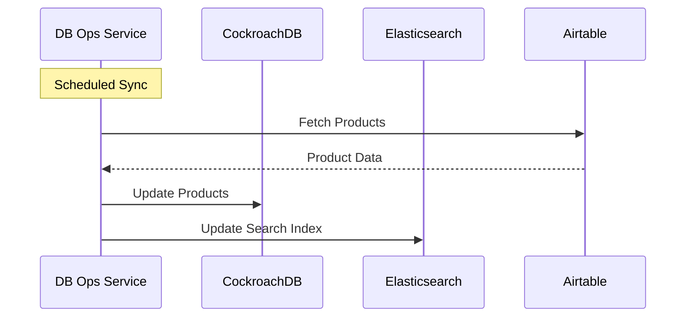
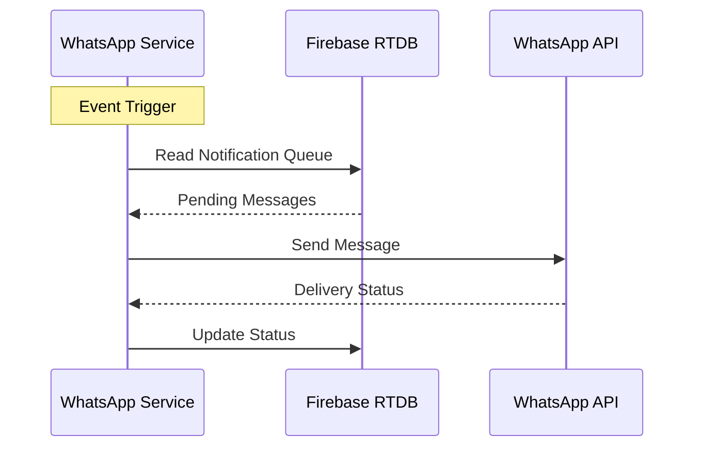
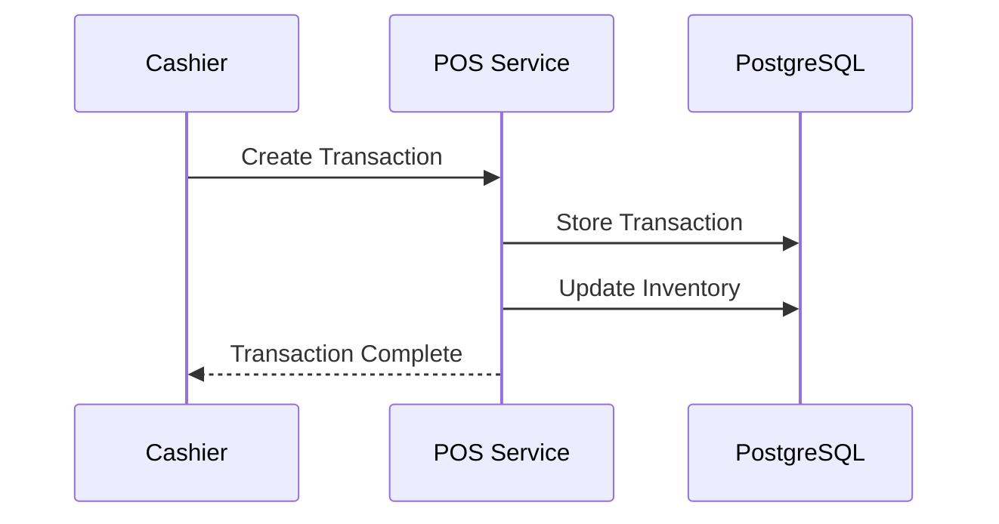
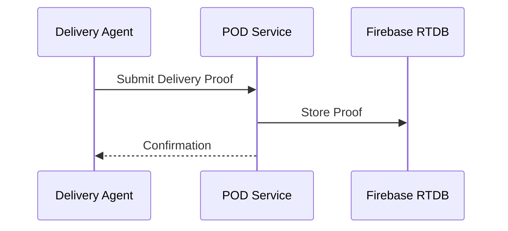

# Plazza Services Overview

## Table of Contents
1. [Catalogue Service](#1-catalogue-service)
2. [Payment Service](#2-payment-service)
3. [Order Service](#3-order-service)
4. [Location Service](#4-location-service)
5. [User Events Service](#5-user-events-service)
6. [Discount Service](#6-discount-service)
7. [Database Operations Service](#7-database-operations-service)
8. [WhatsApp Service](#8-whatsapp-service)
9. [Point of Sale Service](#9-point-of-sale-service)
10. [Proof of Delivery Service](#10-proof-of-delivery-service)

## 1. Catalogue Service

### Main Function
Handles medicine search and prescription processing, providing a robust search engine for the medicine catalogue.

### Important Endpoints
1. **Product Search**
   ```typescript
   POST /products/search
   Body: {
       query: string;
       filters?: {
           manufacturer?: string[];
           priceRange?: { min: number; max: number; }
       }
   }
   ```

2. **Prescription Upload**
   ```typescript
   POST /prescriptions/upload
   Body: {
       image: Base64String;
       format: 'jpg' | 'png' | 'pdf';
   }
   ```

3. **Product Management**
   ```typescript
   GET /products
   Query: {
       search?: string;
       category?: string;
       page?: number;
       limit?: number;
   }
   ```

### Data Models
```typescript
interface Product {
    product_id: string;
    name: string;
    normalized_name: string;
    strength: string;
    manufacturer: string;
    mrp: number;
    distributor_mrp?: number;
    fulfilled_by: 'Plazza' | 'Partner';
    prescription_required: boolean;
    packaging_detail: string;
    image_url?: string;
    created_at: timestamp;
    updated_at: timestamp;
}

interface PrescriptionResult {
    prescription_id: string;
    patient_name?: string;
    doctor_name?: string;
    clinic_details?: {
        name: string;
        address: string;
        contact: string;
    };
    medicines: Array<{
        name: string;
        dosage?: string;
        duration?: string;
        matches: Array<Product>;
    }>;
}
```

### Flow Diagrams

#### Prescription Processing Flow


## 2. Payment Service

### Main Function
Handles all payment-related operations including payment processing, refunds, and integration with Razorpay.

### Important Endpoints
1. **Create Payment**
   ```typescript
   POST /payments/create
   Body: {
       order_id: string;
       amount: number;
       currency: string;
   }
   ```

2. **Verify Payment**
   ```typescript
   POST /payments/verify
   Body: {
       payment_id: string;
       signature: string;
   }
   ```

3. **Process Refund**
   ```typescript
   POST /payments/refund
   Body: {
       payment_id: string;
       amount: number;
       reason: string;
   }
   ```

### Data Models
```typescript
interface Payment {
    payment_id: string;
    order_id: string;
    amount: number;
    currency: string;
    status: 'pending' | 'success' | 'failed' | 'refunded';
    razorpay_order_id: string;
    razorpay_payment_id?: string;
    razorpay_signature?: string;
    refund_id?: string;
    created_at: timestamp;
    updated_at: timestamp;
    user_id: string;
    payment_method: string;
}

interface Refund {
    refund_id: string;
    payment_id: string;
    amount: number;
    status: 'pending' | 'processed' | 'failed';
    reason: string;
    created_at: timestamp;
    processed_at?: timestamp;
}
```

### Flow Diagram


## 3. Order Service

### Main Function
Manages the complete order lifecycle from creation to fulfillment.

### Important Endpoints
1. **Create Order**
   ```typescript
   POST /orders
   Body: {
       items: Array<{
           product_id: string;
           quantity: number;
       }>;
       address_id: string;
       coupon_code?: string;
   }
   ```

2. **Get Order Status**
   ```typescript
   GET /orders/:orderId
   ```

3. **Get Order History**
   ```typescript
   GET /orders/history
   Query: {
       page?: number;
       limit?: number;
       status?: OrderStatus;
   }
   ```

### Data Models
```typescript
interface Order {
    order_id: string;
    user_id: string;
    status: 'pending' | 'confirmed' | 'processing' | 'shipped' | 'delivered' | 'cancelled';
    items: Array<{
        product_id: string;
        quantity: number;
        price: number;
        discount?: number;
    }>;
    shipping_address: Address;
    payment_details: {
        payment_id: string;
        amount: number;
        status: string;
    };
    delivery_details?: {
        tracking_id: string;
        provider: string;
        estimated_delivery: timestamp;
    };
    created_at: timestamp;
    updated_at: timestamp;
}

interface AirtableOrder {
    Record_ID: string;
    Order_ID: string;
    Customer_Name: string;
    Order_Status: string;
    Payment_Status: string;
    Delivery_Status: string;
    Total_Amount: number;
    Items: string;
    Created_Time: string;
    Last_Modified_Time: string;
}
```

### Flow Diagram


## 4. Location Service

### Main Function
Handles address management, serviceability checks, and location-based services.

### Important Endpoints
1. **Create/Update Address**
   ```typescript
   POST /addresses
   Body: Address
   ```

2. **Check Serviceability**
   ```typescript
   POST /serviceability/check
   Body: {
       pincode: string;
       coordinates?: {
           latitude: number;
           longitude: number;
       }
   }
   ```

3. **Area Search**
   ```typescript
   GET /areas/search
   Query: {
       query: string;
       limit?: number;
   }
   ```

### Data Models
```typescript
interface Address {
    id: string;
    user_id: string;
    type: 'home' | 'work' | 'other';
    address_line1: string;
    address_line2?: string;
    city: string;
    state: string;
    pincode: string;
    landmark?: string;
    latitude: number;
    longitude: number;
    is_default: boolean;
    created_at: timestamp;
    updated_at: timestamp;
}

interface ServiceableArea {
    id: string;
    pincode: string;
    city: string;
    state: string;
    is_serviceable: boolean;
    delivery_time: string;
    delivery_charge: number;
    min_order_value: number;
    created_at: timestamp;
    updated_at: timestamp;
}
```

### Flow Diagram


## 5. User Events Service

### Main Function
Tracks user activity and sessions for analytics and personalization.

### Important Endpoints
1. **Create Event**
   ```typescript
   POST /events
   Body: {
       event_type: string;
       event_data: Record<string, any>;
   }
   ```

2. **Get Session**
   ```typescript
   GET /sessions/:sessionId
   ```

### Data Models
```typescript
interface Session {
    session_id: string;
    user_id: string;
    device_info: {
        type: string;
        os: string;
        browser?: string;
    };
    start_time: timestamp;
    end_time?: timestamp;
    is_active: boolean;
}

interface Event {
    event_id: string;
    session_id: string;
    user_id: string;
    event_type: string;
    event_data: Record<string, any>;
    timestamp: timestamp;
}
```

### Flow Diagram


## 6. Discount Service

### Main Function
Manages coupon codes and discount calculations.

### Important Endpoints
1. **Validate Coupon**
   ```typescript
   POST /coupons/validate
   Body: {
       code: string;
       order_amount: number;
       user_id: string;
   }
   ```

2. **Apply Discount**
   ```typescript
   POST /coupons/apply
   Body: {
       code: string;
       order_id: string;
   }
   ```

### Data Models
```typescript
interface Coupon {
    code: string;
    type: 'percentage' | 'fixed';
    value: number;
    min_order_value?: number;
    max_discount?: number;
    valid_from: timestamp;
    valid_until: timestamp;
    usage_limit?: number;
    current_usage: number;
    user_specific?: boolean;
    user_id?: string;
    is_active: boolean;
    created_at: timestamp;
    updated_at: timestamp;
}

interface CouponUsage {
    id: string;
    coupon_code: string;
    user_id: string;
    order_id: string;
    discount_amount: number;
    used_at: timestamp;
}
```

### Flow Diagram


## 7. Database Operations Service

### Main Function
Handles data synchronization between different databases and vendor product mapping.

### Important Methods
1. **Sync Products**
   ```typescript
   async function syncProducts(source: string, destination: string): Promise<SyncStatus>
   ```

2. **Map Vendor Products**
   ```typescript
   async function mapVendorProducts(vendorProducts: VendorProduct[]): Promise<VendorProduct[]>
   ```

### Data Models
```typescript
interface SyncStatus {
    id: string;
    source: string;
    destination: string;
    last_sync_time: timestamp;
    records_processed: number;
    status: 'success' | 'failed' | 'in_progress';
    error_log?: string;
}

interface VendorProduct {
    vendor_id: string;
    vendor_product_id: string;
    plazza_product_id: string;
    confidence_score: number;
    last_verified: timestamp;
    created_at: timestamp;
    updated_at: timestamp;
}
```

### Flow Diagram


## 8. WhatsApp Service

### Main Function
Handles WhatsApp communications for order updates and customer support.

### Important Endpoints
1. **Send Notification**
   ```typescript
   POST /notifications/send
   Body: {
       user_id: string;
       type: 'order_confirmation' | 'delivery_update' | 'support';
       parameters: Record<string, string>;
   }
   ```

### Data Models
```typescript
interface WhatsAppMessage {
    message_id: string;
    user_id: string;
    phone_number: string;
    type: 'order_confirmation' | 'delivery_update' | 'support';
    status: 'pending' | 'sent' | 'delivered' | 'failed';
    content: {
        template_name: string;
        parameters: Record<string, string>;
    };
    sent_at?: timestamp;
    delivered_at?: timestamp;
    created_at: timestamp;
}
```

### Flow Diagram


## 9. Point of Sale Service

### Main Function
Manages in-store transactions and inventory.

### Important Endpoints
1. **Create Transaction**
   ```typescript
   POST /transactions
   Body: {
       items: Array<{
           product_id: string;
           quantity: number;
       }>;
       payment_method: string;
   }
   ```

2. **Update Inventory**
   ```typescript
   PUT /inventory/:storeId
   Body: {
       product_id: string;
       quantity: number;
   }
   ```

### Data Models
```typescript
interface POSTransaction {
    transaction_id: string;
    store_id: string;
    cashier_id: string;
    items: Array<{
        product_id: string;
        quantity: number;
        price: number;
        discount?: number;
    }>;
    payment_method: string;
    total_amount: number;
    discount_amount: number;
    final_amount: number;
    created_at: timestamp;
}

interface StoreInventory {
    store_id: string;
    product_id: string;
    quantity: number;
    last_updated: timestamp;
}
```

### Flow Diagram


## 10. Proof of Delivery Service

### Main Function
Manages delivery confirmations and proof collection.

### Important Endpoints
1. **Create Delivery Proof**
   ```typescript
   POST /delivery/proof
   Body: {
       order_id: string;
       proof_type: 'signature' | 'photo' | 'otp';
       proof_data: {
           image_url?: string;
           signature_url?: string;
           otp?: string;
           geolocation?: {
               latitude: number;
               longitude: number;
           };
       };
   }
   ```

2. **Verify Delivery**
   ```typescript
   POST /delivery/verify/:orderId
   Body: {
       verification_type: string;
       verification_data: any;
   }
   ```

### Data Models
```typescript
interface DeliveryProof {
    proof_id: string;
    order_id: string;
    delivery_agent_id: string;
    status: 'pending' | 'completed' | 'failed';
    proof_type: 'signature' | 'photo' | 'otp';
    proof_data: {
        image_url?: string;
        signature_url?: string;
        otp?: string;
        geolocation?: {
            latitude: number;
            longitude: number;
        };
    };
    timestamp: timestamp;
    notes?: string;
}
```

### Flow Diagram


Would you like me to:
1. Add more detailed flow diagrams for specific processes?
2. Include more API endpoint details?
3. Add error handling scenarios?
4. Include integration examples between services? 