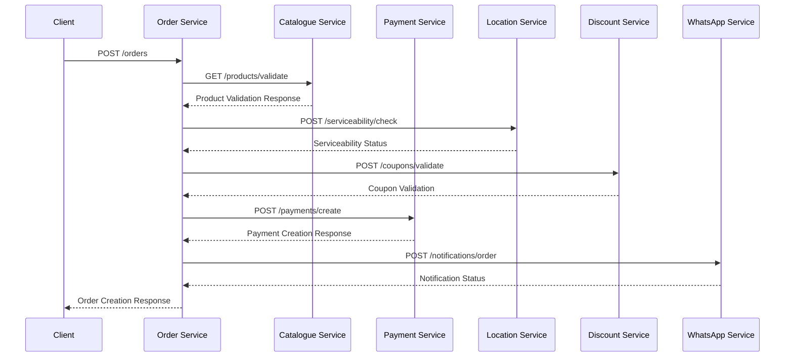
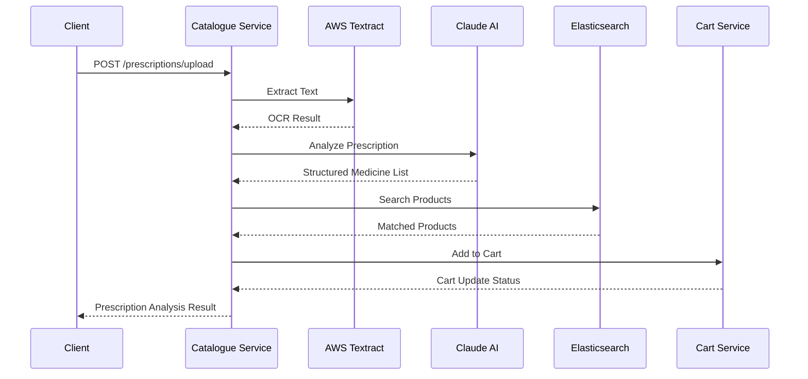
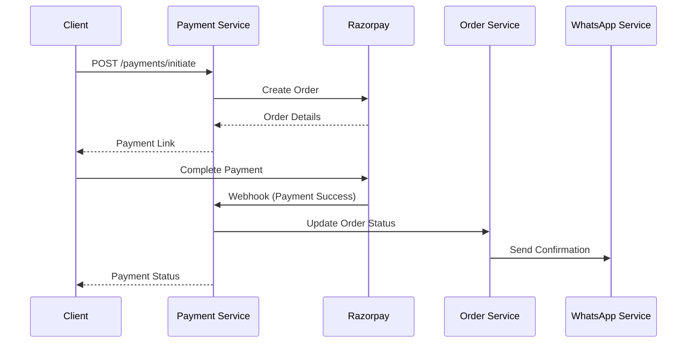

# Plazza API Interactions

## Service Communication Patterns

### 1. Order Creation Flow


### 2. Prescription Upload Flow


### 3. Payment Processing Flow


## API Endpoints by Service

### 1. Catalogue Service
```typescript
interface CatalogueAPI {
    // Product Management
    'GET /products': {
        query: {
            search?: string;
            category?: string;
            page?: number;
            limit?: number;
        };
        response: Product[];
    };
    
    // Prescription Processing
    'POST /prescriptions/upload': {
        body: {
            image: Base64String;
            format: 'jpg' | 'png' | 'pdf';
        };
        response: PrescriptionResult;
    };
    
    // Product Search
    'POST /products/search': {
        body: {
            query: string;
            filters?: {
                manufacturer?: string[];
                priceRange?: {
                    min: number;
                    max: number;
                };
            };
        };
        response: SearchResult;
    };
}
```

### 2. Order Service
```typescript
interface OrderAPI {
    // Order Management
    'POST /orders': {
        body: {
            items: Array<{
                product_id: string;
                quantity: number;
            }>;
            address_id: string;
            coupon_code?: string;
        };
        response: Order;
    };
    
    // Order Status
    'GET /orders/:orderId': {
        response: OrderDetails;
    };
    
    // Order History
    'GET /orders/history': {
        query: {
            page?: number;
            limit?: number;
            status?: OrderStatus;
        };
        response: OrderHistory;
    };
}
```

### 3. Payment Service
```typescript
interface PaymentAPI {
    // Payment Creation
    'POST /payments/create': {
        body: {
            order_id: string;
            amount: number;
            currency: string;
        };
        response: PaymentDetails;
    };
    
    // Payment Verification
    'POST /payments/verify': {
        body: {
            payment_id: string;
            signature: string;
        };
        response: VerificationResult;
    };
    
    // Refund Processing
    'POST /payments/refund': {
        body: {
            payment_id: string;
            amount: number;
            reason: string;
        };
        response: RefundDetails;
    };
}
```

### 4. Location Service
```typescript
interface LocationAPI {
    // Address Management
    'POST /addresses': {
        body: Address;
        response: AddressDetails;
    };
    
    // Serviceability Check
    'POST /serviceability/check': {
        body: {
            pincode: string;
            coordinates?: {
                latitude: number;
                longitude: number;
            };
        };
        response: ServiceabilityResult;
    };
    
    // Area Search
    'GET /areas/search': {
        query: {
            query: string;
            limit?: number;
        };
        response: AreaSearchResult;
    };
}
```

## Error Handling

### Standard Error Response
```typescript
interface ErrorResponse {
    status: 'error';
    code: string;
    message: string;
    details?: Record<string, any>;
    traceId: string;
}
```

### Common Error Codes
```typescript
enum ErrorCodes {
    VALIDATION_ERROR = 'VALIDATION_ERROR',
    RESOURCE_NOT_FOUND = 'RESOURCE_NOT_FOUND',
    UNAUTHORIZED = 'UNAUTHORIZED',
    FORBIDDEN = 'FORBIDDEN',
    INTERNAL_ERROR = 'INTERNAL_ERROR',
    SERVICE_UNAVAILABLE = 'SERVICE_UNAVAILABLE'
}
```

## Authentication

### JWT Token Structure
```typescript
interface JWTPayload {
    user_id: string;
    role: UserRole;
    permissions: string[];
    exp: number;
    iat: number;
}
```

### Authentication Headers
```typescript
interface AuthHeaders {
    'Authorization': `Bearer ${string}`;
    'X-API-Key'?: string;
}
```

## Rate Limiting

### Rate Limit Configuration
```typescript
interface RateLimitConfig {
    window: number;  // Time window in seconds
    max: number;     // Maximum requests in window
    headers: {
        remaining: 'X-RateLimit-Remaining';
        reset: 'X-RateLimit-Reset';
        total: 'X-RateLimit-Total';
    };
}
```

Would you like me to:
1. Add more specific API endpoints for any service?
2. Include request/response examples?
3. Add more error handling scenarios?
4. Create service-specific API documentation? 