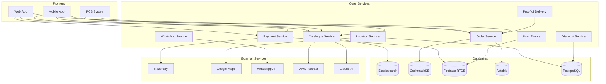
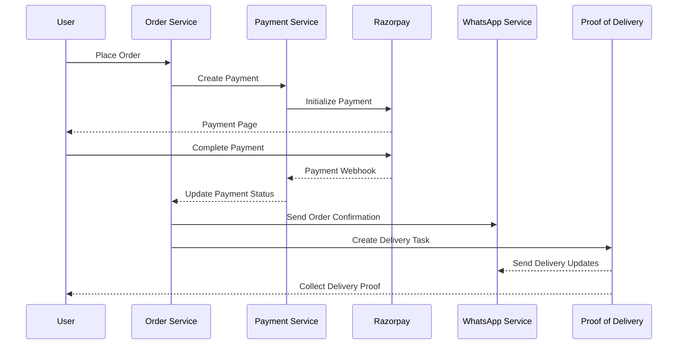
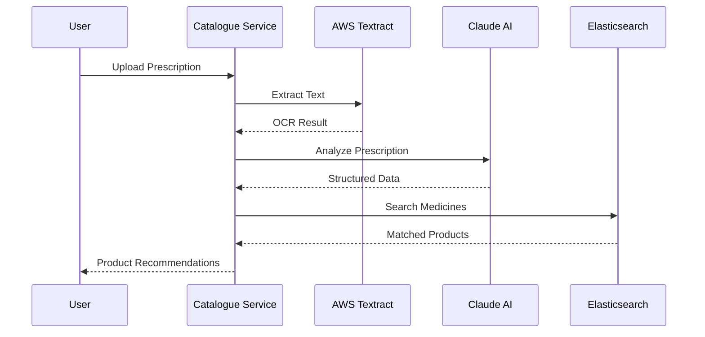

# Plazza Architecture Documentation

## System Architecture Diagram



## Service-Specific Database Models

### 1. Catalogue Service
```typescript
// Elasticsearch Product Index
interface Product {
    product_id: string;
    name: string;
    normalized_name: string;
    strength: string;
    manufacturer: string;
    mrp: number;
    distributor_mrp?: number;
    fulfilled_by: 'Plazza' | 'Partner';
    prescription_required: boolean;
    packaging_detail: string;
    image_url?: string;
    created_at: timestamp;
    updated_at: timestamp;
}

// Prescription Analysis Result
interface PrescriptionResult {
    prescription_id: string;
    patient_name?: string;
    doctor_name?: string;
    clinic_details?: {
        name: string;
        address: string;
        contact: string;
    };
    medicines: Array<{
        name: string;
        dosage?: string;
        duration?: string;
        matches: Array<Product>;
    }>;
}
```

### 2. Payment Service
```typescript
// Firebase Realtime Database
interface Payment {
    payment_id: string;
    order_id: string;
    amount: number;
    currency: string;
    status: 'pending' | 'success' | 'failed' | 'refunded';
    razorpay_order_id: string;
    razorpay_payment_id?: string;
    razorpay_signature?: string;
    refund_id?: string;
    created_at: timestamp;
    updated_at: timestamp;
    user_id: string;
    payment_method: string;
}

interface Refund {
    refund_id: string;
    payment_id: string;
    amount: number;
    status: 'pending' | 'processed' | 'failed';
    reason: string;
    created_at: timestamp;
    processed_at?: timestamp;
}
```

### 3. Order Service
```typescript
// CockroachDB
interface Order {
    order_id: string;
    user_id: string;
    status: 'pending' | 'confirmed' | 'processing' | 'shipped' | 'delivered' | 'cancelled';
    items: Array<{
        product_id: string;
        quantity: number;
        price: number;
        discount?: number;
    }>;
    shipping_address: Address;
    payment_details: {
        payment_id: string;
        amount: number;
        status: string;
    };
    delivery_details?: {
        tracking_id: string;
        provider: string;
        estimated_delivery: timestamp;
    };
    created_at: timestamp;
    updated_at: timestamp;
}

// Airtable
interface AirtableOrder {
    Record_ID: string;
    Order_ID: string;
    Customer_Name: string;
    Order_Status: string;
    Payment_Status: string;
    Delivery_Status: string;
    Total_Amount: number;
    Items: string; // JSON string of items
    Created_Time: string;
    Last_Modified_Time: string;
}
```

### 4. Location Service
```typescript
// PostgreSQL
interface Address {
    id: string;
    user_id: string;
    type: 'home' | 'work' | 'other';
    address_line1: string;
    address_line2?: string;
    city: string;
    state: string;
    pincode: string;
    landmark?: string;
    latitude: number;
    longitude: number;
    is_default: boolean;
    created_at: timestamp;
    updated_at: timestamp;
}

interface ServiceableArea {
    id: string;
    pincode: string;
    city: string;
    state: string;
    is_serviceable: boolean;
    delivery_time: string;
    delivery_charge: number;
    min_order_value: number;
    created_at: timestamp;
    updated_at: timestamp;
}
```

### 5. User Events Service
```typescript
// Firebase Realtime Database
interface Session {
    session_id: string;
    user_id: string;
    device_info: {
        type: string;
        os: string;
        browser?: string;
    };
    start_time: timestamp;
    end_time?: timestamp;
    is_active: boolean;
}

interface Event {
    event_id: string;
    session_id: string;
    user_id: string;
    event_type: string;
    event_data: Record<string, any>;
    timestamp: timestamp;
}
```

### 6. Discount Service
```typescript
// PostgreSQL
interface Coupon {
    code: string;
    type: 'percentage' | 'fixed';
    value: number;
    min_order_value?: number;
    max_discount?: number;
    valid_from: timestamp;
    valid_until: timestamp;
    usage_limit?: number;
    current_usage: number;
    user_specific?: boolean;
    user_id?: string;
    is_active: boolean;
    created_at: timestamp;
    updated_at: timestamp;
}

interface CouponUsage {
    id: string;
    coupon_code: string;
    user_id: string;
    order_id: string;
    discount_amount: number;
    used_at: timestamp;
}
```

### 7. Database Operations Service
```typescript
// Sync Status in CockroachDB
interface SyncStatus {
    id: string;
    source: string;
    destination: string;
    last_sync_time: timestamp;
    records_processed: number;
    status: 'success' | 'failed' | 'in_progress';
    error_log?: string;
}

// Vendor Product Mapping
interface VendorProduct {
    vendor_id: string;
    vendor_product_id: string;
    plazza_product_id: string;
    confidence_score: number;
    last_verified: timestamp;
    created_at: timestamp;
    updated_at: timestamp;
}
```

### 8. WhatsApp Service
```typescript
// Firebase Realtime Database
interface WhatsAppMessage {
    message_id: string;
    user_id: string;
    phone_number: string;
    type: 'order_confirmation' | 'delivery_update' | 'support';
    status: 'pending' | 'sent' | 'delivered' | 'failed';
    content: {
        template_name: string;
        parameters: Record<string, string>;
    };
    sent_at?: timestamp;
    delivered_at?: timestamp;
    created_at: timestamp;
}
```

### 9. Point of Sale Service
```typescript
// PostgreSQL
interface POSTransaction {
    transaction_id: string;
    store_id: string;
    cashier_id: string;
    items: Array<{
        product_id: string;
        quantity: number;
        price: number;
        discount?: number;
    }>;
    payment_method: string;
    total_amount: number;
    discount_amount: number;
    final_amount: number;
    created_at: timestamp;
}

interface StoreInventory {
    store_id: string;
    product_id: string;
    quantity: number;
    last_updated: timestamp;
}
```

### 10. Proof of Delivery Service
```typescript
// Firebase Realtime Database
interface DeliveryProof {
    proof_id: string;
    order_id: string;
    delivery_agent_id: string;
    status: 'pending' | 'completed' | 'failed';
    proof_type: 'signature' | 'photo' | 'otp';
    proof_data: {
        image_url?: string;
        signature_url?: string;
        otp?: string;
        geolocation?: {
            latitude: number;
            longitude: number;
        };
    };
    timestamp: timestamp;
    notes?: string;
}
```

## Data Flow Diagrams

### Order Processing Flow


### Prescription Processing Flow


Would you like me to:
1. Add more specific flow diagrams for other processes?
2. Include more detailed database schemas?
3. Add deployment architecture diagrams?
4. Create API interaction diagrams?

Let me know what aspects you'd like me to expand upon. 